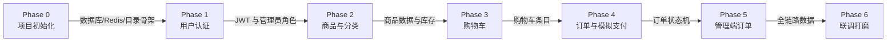

# 模块依赖关系（Dependency Tree）

> 本文件是模块依赖的唯一依据：当前阶段依赖的模块未完成前，禁止开始该阶段（禁止跳过依赖模块开发）。

## 主依赖链



## 树形视图（含依赖原因）

```text
Phase 0 项目初始化
└── 依赖：无（根节点）
    ├── 提供：项目骨架、MySQL/Redis 连接、构建与启动方式

Phase 1 用户认证
├── 依赖：Phase 0（数据库连接、项目骨架）
└── 提供：JWT 认证、users 表、管理员角色字段

Phase 2 商品与分类
├── 依赖：Phase 0（MySQL、uploads 静态目录）
├── 依赖：Phase 1（管理接口需要管理员权限）
└── 提供：分类/商品数据、图片上传、Redis 缓存

Phase 3 购物车
├── 依赖：Phase 1（购物车必须登录）
├── 依赖：Phase 2（加购对象是商品，校验上下架与库存）
└── 提供：cart_items 数据，作为下单数据源

Phase 4 订单与模拟支付
├── 依赖：Phase 1（订单归属当前用户）
├── 依赖：Phase 2（扣减商品库存）
├── 依赖：Phase 3（从购物车创建订单、清空购物车）
└── 提供：orders/order_items 数据与状态机

Phase 5 管理端订单管理
├── 依赖：Phase 1（管理员权限校验）
├── 依赖：Phase 4（管理对象是订单状态）
└── 提供：订单状态流转（发货/完成/取消）

Phase 6 联调打磨
├── 依赖：Phase 0~5 全部
└── 提供：完整链路验收、README/AGENTS.md 定稿
```

## 依赖关系速查表

| Phase | 直接依赖 | 不可用时可做的前置准备（不越阶段） |
|---|---|---|
| 0 | 无 | — |
| 1 | P0 | 设计 JWT 工具函数、注册/登录接口契约 |
| 2 | P0、P1 | 设计商品表结构、图片存储目录约定 |
| 3 | P0、P1、P2 | 设计购物车接口契约 |
| 4 | P0、P1、P2、P3 | 设计订单状态机和事务流程 |
| 5 | P0、P1、P4 | 设计状态流转校验规则 |
| 6 | 全部 | 整理验收清单 |

## 执行规则

- 每个 Phase 开工前，先说明本阶段依赖哪些模块，再开始写代码。
- 依赖未完成时，不允许提前实现后续阶段的功能。
