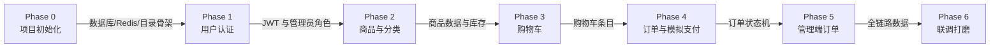

# 模块依赖关系（Dependency Tree）

> 本文件是模块依赖的唯一依据：当前阶段依赖的模块未完成前，禁止开始该阶段（禁止跳过依赖模块开发）。
>
> 说明：`Phase 0–6` 为 V1 阶段表（历史基线）；`V2.0-1 ~ V2.0-9` 为 V2.0 工程化升级阶段，叠加在 V1 功能之上，两套编号相互独立。

## V1 依赖链（历史基线，Phase 0–6）



## V2.0 依赖链（V2.0-1 ~ V2.0-9）

```mermaid
flowchart LR
    V1[V1 功能基线<br/>Phase 0-6] --> A[V2.0-1<br/>安全与启动基础]
    A -->|数据库工程化| B[V2.0-2<br/>数据库工程化]
    B -->|身份与权限| C[V2.0-3<br/>用户身份与权限体系]
    C -->|商品 SKU 化| D[V2.0-4<br/>商品/SKU 体系]
    D -->|认证与权限收敛| E[V2.0-5<br/>认证整合与 RBAC]
    E -->|缓存与降级| F[V2.0-6<br/>Redis 缓存与降级]
    F -->|回归基线| G[V2.0-7<br/>测试与核心业务验证]
    G -->|冷启动与标准化| H[V2.0-8<br/>冷启动与 Docker 标准化]
    H -->|最终检查与交付| I[V2.0-9<br/>最终工程化与交付验收]
```



## 树形视图（含依赖原因）

V1 阶段（历史基线）：

```text
Phase 0 项目初始化
└── 依赖：无（根节点）
    ├── 提供：项目骨架、MySQL/Redis 连接、构建与启动方式

Phase 1 用户认证
├── 依赖：Phase 0（数据库连接、项目骨架）
└── 提供：JWT 认证、users 表、管理员角色字段

Phase 2 商品与分类
├── 依赖：Phase 0（MySQL、uploads 静态目录）
├── 依赖：Phase 1（管理接口需要管理员权限）
└── 提供：分类/商品数据、图片上传、Redis 缓存

Phase 3 购物车
├── 依赖：Phase 1（购物车必须登录）
├── 依赖：Phase 2（加购对象是商品，校验上下架与库存）
└── 提供：cart_items 数据，作为下单数据源

Phase 4 订单与模拟支付
├── 依赖：Phase 1（订单归属当前用户）
├── 依赖：Phase 2（扣减商品库存）
├── 依赖：Phase 3（从购物车创建订单、清空购物车）
└── 提供：orders/order_items 数据与状态机

Phase 5 管理端订单管理
├── 依赖：Phase 1（管理员权限校验）
├── 依赖：Phase 4（管理对象是订单状态）
└── 提供：订单状态流转（发货/完成/取消）

Phase 6 联调打磨
├── 依赖：Phase 0~5 全部
└── 提供：完整链路验收、README/AGENTS.md 定稿
```

V2.0 阶段（叠加在 V1 功能之上）：

```text
V2.0-1 安全与启动基础
├── 依赖：V1 Phase 0~6（在 V1 功能之上做安全与工程化）
└── 提供：JWT Secret 强制校验、可重复启动、测试隔离

V2.0-2 数据库工程化
├── 依赖：V2.0-1
└── 提供：Alembic 迁移、事务/Session 管理、异常与 API 规范、分层与查询质量

V2.0-3 用户身份与权限体系
├── 依赖：V2.0-1、V2.0-2
└── 提供：注册安全、Access/Refresh Token 生命周期、RBAC、用户状态

V2.0-4 商品/SKU 体系
├── 依赖：V2.0-2、V2.0-3（身份与数据库工程化）
└── 提供：商品→SKU→规格结构、SKU 库存/价格、订单快照、多图

V2.0-5 认证整合与 RBAC
├── 依赖：V2.0-1 ~ V2.0-4
└── 提供：认证面收敛、集中权限依赖、管理端用户管理

V2.0-6 Redis 缓存与降级
├── 依赖：V2.0-5
└── 提供：商品/分类缓存、写后失效、故障降级语义（fail-open / fail-closed）

V2.0-7 测试与核心业务验证
├── 依赖：V2.0-1 ~ V2.0-6（回归对象）
└── 提供：312 用例回归基线；认证/权限/Redis 缓存与降级行为锁定

V2.0-8 冷启动与 Docker 环境标准化
├── 依赖：V2.0-7（以完整测试基线为前提）
└── 提供：一键启动、环境变量/配置标准化、全新环境冷启动验证

V2.0-9 最终工程化与交付验收
├── 依赖：V2.0-1 ~ V2.0-8（最终检查与收尾对象）
└── 提供：整体/安全/GitHub/文档/Docker 重建/全链路最终验收与交付报告
```

## 依赖关系速查表（V1）

| Phase | 直接依赖 | 不可用时可做的前置准备（不越阶段） |
|---|---|---|
| 0 | 无 | — |
| 1 | P0 | 设计 JWT 工具函数、注册/登录接口契约 |
| 2 | P0、P1 | 设计商品表结构、图片存储目录约定 |
| 3 | P0、P1、P2 | 设计购物车接口契约 |
| 4 | P0、P1、P2、P3 | 设计订单状态机和事务流程 |
| 5 | P0、P1、P4 | 设计状态流转校验规则 |
| 6 | 全部 | 整理验收清单 |

## 依赖关系速查表（V2.0）

| 阶段 | 直接依赖 | 不可用时可做的前置准备（不越阶段） |
|---|---|---|
| V2.0-1 | V1 Phase 0~6 | 整理安全清单与冷启动检查项 |
| V2.0-2 | V2.0-1 | 设计迁移脚本与分层规范 |
| V2.0-3 | V2.0-1、V2.0-2 | 设计 Token 生命周期与权限矩阵 |
| V2.0-4 | V2.0-2、V2.0-3 | 设计 SKU/规格数据模型与校验规则 |
| V2.0-5 | V2.0-1 ~ V2.0-4 | 梳理认证面与权限边界 |
| V2.0-6 | V2.0-5 | 设计缓存键与降级语义 |
| V2.0-7 | V2.0-1 ~ V2.0-6 | 制定回归范围与验收证据清单 |
| V2.0-8 | V2.0-7 | 梳理环境变量、启动脚本与冷启动文档 |
| V2.0-9 | V2.0-1 ~ V2.0-8 | 汇总各阶段验收报告与测试证据，输出最终交付报告 |

## 执行规则

- 每个 Phase 开工前，先说明本阶段依赖哪些模块，再开始写代码。
- 依赖未完成时，不允许提前实现后续阶段的功能。
