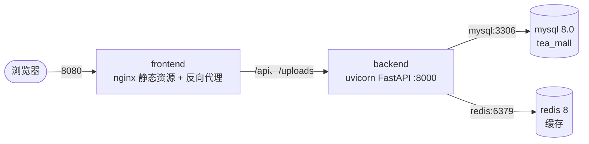

# TeaMall Docker 部署文档

本文档说明 TeaMall 的 Docker 部署架构、容器关系、启动流程与常见问题。一键部署命令：

```bash
docker compose up -d
```

## 项目架构

平台由 4 个容器组成，运行在同一个 bridge 网络 `tea-mall-net` 内，服务之间通过容器名通信：



## 容器职责

| 容器 | 镜像 | 职责 | 宿主端口（默认） |
| --- | --- | --- | --- |
| frontend | 自构建（node:20 → nginx:1.27） | 托管 Vue3 构建产物；`/api`、`/uploads` 反代到 backend | 8080 |
| backend | 自构建（python:3.13-slim） | FastAPI 应用；启动时自动建表；商品图片存储 | 8000 |
| mysql | mysql:8.0 | 数据库；环境变量 + init.sql 首次初始化 | 3307 |
| redis | redis:8-alpine | 分类/商品缓存（TTL 5 分钟） | 6379 |

端口均可在 `.env` 中通过 `FRONTEND_PORT` / `BACKEND_PORT` / `MYSQL_PORT` / `REDIS_PORT` 覆盖。

## 容器关系与启动顺序

Docker Compose 通过健康检查保证依赖顺序：

1. `mysql` 健康：`mysqladmin ping` 成功；`redis` 健康：`redis-cli ping` 返回 PONG。
2. `backend` 等待 mysql、redis 均 `healthy` 后才启动；自身健康检查请求 `/api/health`（同时验证数据库与 Redis 连接）。
3. `frontend` 等待 backend `healthy` 后启动，nginx 对外提供服务。

`depends_on` 配置：

- backend → mysql（service_healthy）、redis（service_healthy）
- frontend → backend（service_healthy）

## 启动流程

1. 安装 Docker Desktop 后，克隆仓库并进入项目目录。
2. 复制环境变量文件：`cp .env.example .env`（Windows 用 `Copy-Item`），按需修改密码与端口。
3. 执行 `docker compose up -d`：
   - 自动创建网络 `tea-mall-net` 与数据卷；
   - 构建前后端镜像（首次较慢）；
   - MySQL 首次启动时由 `MYSQL_DATABASE` / `MYSQL_USER` / `MYSQL_PASSWORD` 环境变量创建库与用户，并执行挂载的 `database/init.sql`（幂等，双保险）；
   - 后端连接 MySQL 后执行 `create_all` 自动创建数据表；
   - 全部就绪后，前端与后端 API 对外可访问。
4. 可选：`docker compose exec backend python seed.py` 初始化管理员与示例数据。

## 数据持久化

| 数据卷 | 挂载点 | 内容 |
| --- | --- | --- |
| mysql-data | /var/lib/mysql | MySQL 数据文件 |
| redis-data | /data | Redis AOF 持久化 |
| uploads | /app/uploads | 后端上传的商品图片 |

`docker compose down` 停止容器但保留数据；`docker compose down -v` 会删除数据卷，数据库与图片不可恢复，谨慎使用。

## 环境变量说明

关键变量（全部来自根目录 `.env`，详见 `.env.example`）：

- `MYSQL_ROOT_PASSWORD` / `MYSQL_PASSWORD`：MySQL root 与应用账号密码（仅首次初始化生效）。
- `DATABASE_URL`：后端连接串，host 必须是服务名 `mysql`；修改密码时需与 `MYSQL_PASSWORD` 同步。
- `REDIS_URL`：host 为服务名 `redis`。
- `JWT_SECRET`：生产环境务必改为随机长字符串（至少 32 字节）。
- `JWT_EXPIRE_DAYS`：token 有效期（天）。

## 常见问题

**1. 端口冲突（如本机已装 MySQL）**

MySQL 容器默认映射宿主 3307 端口，避免与本机 3306 冲突。仍冲突时修改 `.env` 中的 `MYSQL_PORT` / `REDIS_PORT` / `FRONTEND_PORT` / `BACKEND_PORT` 后重新 `docker compose up -d`。

**2. 数据库连接失败（后端日志报 connect error）**

多为密码不一致：`.env` 中 `DATABASE_URL` 内的密码必须与 `MYSQL_PASSWORD` 相同；修改密码后需 `docker compose down -v && docker compose up -d` 重建数据卷（或删除 `mysql-data` 卷）才生效。

**3. 前端页面打开但接口 502**

backend 尚未就绪或已退出。先 `docker compose ps` 查看状态，再 `docker compose logs -f backend` 查看错误。

**4. 容器反复 restarting**

`docker compose logs <service>` 查看具体报错；常见原因：环境变量缺失、端口占用、MySQL 初始化失败。

**5. 镜像拉取 / 构建失败（网络原因）**

若无法访问 Docker Hub，可在 Docker Desktop → Settings → Docker Engine 配置 `registry-mirrors` 镜像加速，或配置代理后重试。

**6. 修改业务代码后如何生效**

```bash
docker compose build frontend backend
docker compose up -d
```

**7. 需要重置数据库重新初始化**

```bash
docker compose down -v
docker compose up -d
```

注意：这会清空所有数据（包括上传的图片）。
